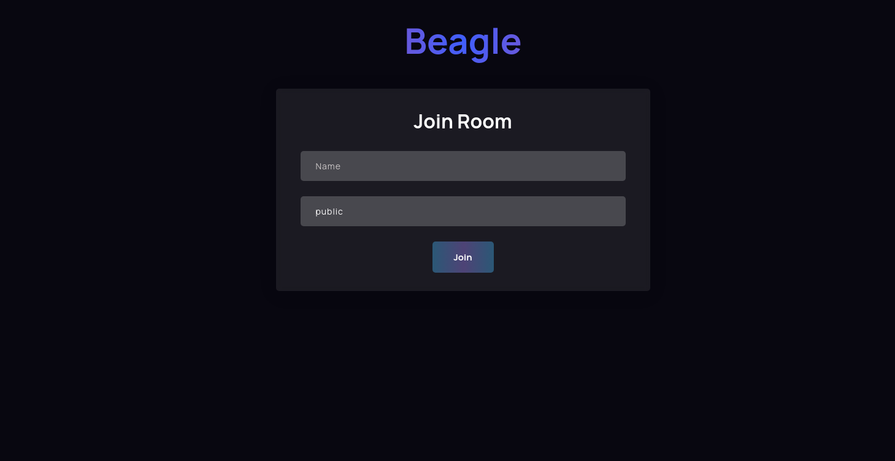
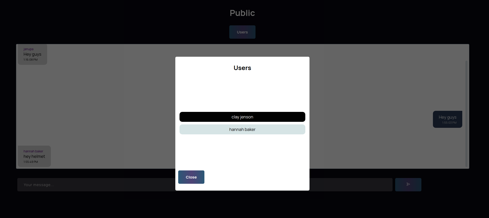
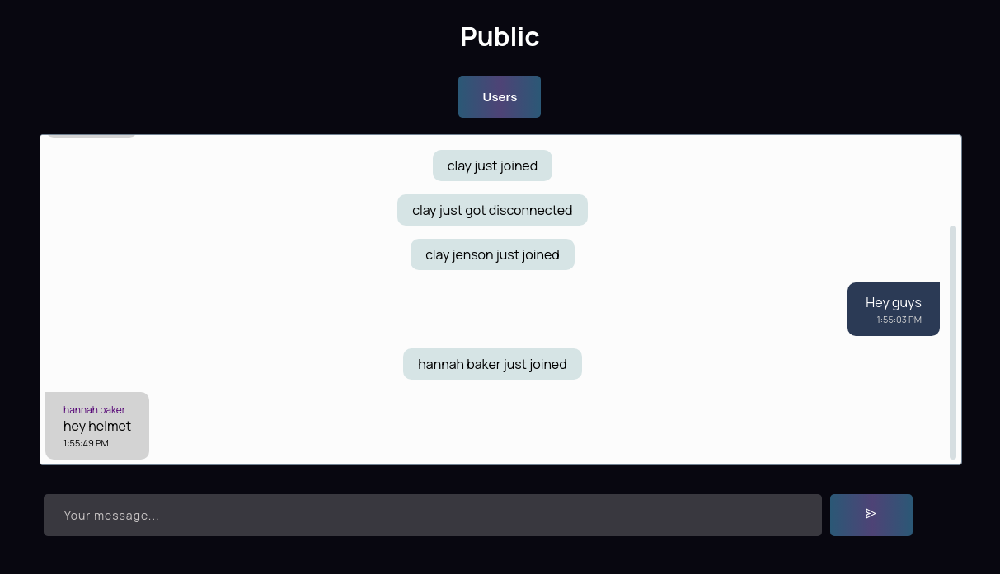

# Welcome to Beagle

### A simple chat room application

##### This is a simple application where you can join a room and chat with others

#### How to setup

1.  Clone the repository
2.  Copy the .env.example to and .env file in the server folder
3.  Copy the .env.example to and .env.local file in the client folder
4.  Install dependencies in both projects
5.  Enjoy

#### Here are some images

 

 

